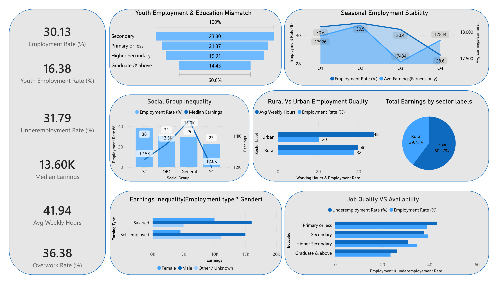

# India Employment & Labour Market Analytics – PLFS Microdata

_Analyzing employment access, job quality, earnings stability, and structural labour market inequalities in India using PLFS microdata, using SQL, Python-based EDA, statistical testing, and a Power BI dashboard._

---

## 📌 Table of Contents
- <a href="#overview">Overview</a>
- <a href="#business-problem">Business Problem</a>
- <a href="#dataset">Dataset</a>
- <a href="#end-to-end-data-pipeline">End-to-End Data Pipeline</a>
- <a href="#tools--technologies">Tools & Technologies</a>
- <a href="#project-structure">Project Structure</a>
- <a href="#data-cleaning--feature-engineering">Data Cleaning & Feature Engineering</a>
- <a href="#exploratory-data-analysis-eda">Exploratory Data Analysis (EDA)</a>
- <a href="#statistical-analysis">Statistical Analysis</a>
- <a href="#dashboard">Power BI Dashboard</a>
- <a href="#key-findings--business--policy-impact">Key Findings & Business / Policy Impact</a>
- <a href="#how-to-run-this-project">How to Run This Project</a>
- <a href="#author--contact">Author & Contact</a>

---
<h2><a class="anchor" id="overview"></a>Overview</h2>

This project performs a **comprehensive labour market analysis of India** using **Periodic Labour Force Survey (PLFS) microdata**.  
The objective is to move beyond headline employment rates and evaluate **job quality, underemployment, earnings instability, overwork, and structural inequality**.

The project follows a **production-style analytics workflow**:
- SQL-based data ingestion and transformation  
- Python-based exploratory data analysis and statistical validation  
- Power BI dashboarding for decision-ready insights  

---
<h2><a class="anchor" id="business-problem "></a>Business Problem</h2>

Standard employment indicators often fail to capture real labour market conditions.  
This project addresses the following analytical questions:
- Is youth unemployment structurally higher than adult unemployment?
- Does higher education improve employment outcomes for youth?
- How does job quality differ between rural and urban labour markets?
- Are employed individuals adequately employed in terms of working hours?
- How large are earnings gaps across gender, employment type, and social groups?
- How does household dependency burden affect living standards?
- Are employment and earnings stable across calendar quarters?

---
<h2><a class="anchor" id="dataset"></a>Dataset</h2>

- **Source**: Periodic Labour Force Survey (PLFS), Government of India (data.gov.in)
- **Data Type**: Microdata (individual & household level)
- **Key Attributes**:
  - Employment status
  - Age (Youth: 15–29, Adults)
  - Gender
  - Education level
  - Rural / Urban sector
  - Weekly working hours
  - Earnings & income indicators
  - Employment type
  - Social group (SC, ST, OBC, General)
  - Household dependency ratio
  - Calendar quarter

---
<h2><a class="anchor" id="end-to-end-data-pipeline"></a>End-to-End Data Pipeline</h2>

This project implements a **full analytics data pipeline**, similar to real-world data analyst workflows.

### 1. SQL Data Pipeline (ETL)

- Raw PLFS data ingested into SQL database
- SQL used for:
  - Data filtering and validation
  - Creation of analytical tables
  - Aggregations by age, gender, education, sector, and social group
  - Feature preparation for downstream analysis

**SQL Operations Used**
- SELECT, WHERE, GROUP BY, HAVING
- CASE WHEN logic for categorical variables
- Aggregations (COUNT, AVG, MEDIAN equivalents)
- Data joins and transformations

### 2. Python Analysis Layer

- SQL outputs loaded into Python using Pandas
- Additional feature engineering
- Exploratory Data Analysis (EDA)
- Statistical hypothesis testing (Chi-square)

### 3. Power BI Visualization Layer

- Clean analytical tables connected to Power BI
- Interactive dashboards and KPIs created
- Business- and policy-ready insights generated

---
<h2><a class="anchor" id="tools--technologies"></a>Tools & Technologies</h2>

- SQL (Data Extraction, Transformation, Aggregation,Joins,Common Table Expressions)
- Python (Pandas, NumPy, Matplotlib, Seaborn, SciPy)
- Power BI (Dashboarding, KPIs, Visual Analytics)
- Statistical Analysis
- Git & GitHub

---
<h2><a class="anchor" id="project-structure"></a>Project Structure</h2>

```
India-Employment-Labour-Market-Analytics/
│
├── Readme.md
|
├── notebooks/                  # Jupyter notebooks
│   ├── Exploratory data analysis (India Employment & Labour Market Analytics using PLFS Microdata).ipynb
│   ├── India Employment & Labour Market Analytics using PLFS Microdata.ipynb
|
├── dashboard/                  # Power BI dashboard file
│   └── India Employment & Labour Market Analytics using PLFS Microdata.pbix
|
├── India Employment & Labour Market Analytics using PLFS Microdata.pdf

```

---
<h2><a class="anchor" id="data-cleaning--feature-engineering"></a>Data Cleaning & Feature Engineering</h2>

- Preserved zero-income observations as a real economic signal
- Retained missing wage values (NaN) to reflect data limitations
- Created derived variables:
  - Youth vs Adult employment classification
  - Underemployment indicator
  - Overwork indicator (>48 hours/week)
  - Dependency ratio groups
  - Education and social group categories

This approach ensures **data integrity and analytical transparency**.

---
<h2><a class="anchor" id="exploratory-data-analysis-eda"></a>Exploratory Data Analysis (EDA)</h2>

**Key Metrics**
- Employment Rate: **30.13%**
- Youth Employment Rate: **16.38%**
- Underemployment Rate: **31.79%**
- Median Earnings: **₹13.60K**
- Average Weekly Hours: **41.94**
- Overwork Rate: **36.38%**

**Major Findings**
- Youth and graduates face the weakest employment outcomes
- Higher education does not guarantee employment
- Urban employment involves higher work intensity and overwork risk
- Rural employment is more inclusive but less stable
- Significant earnings inequality across gender and social groups
- Seasonal employment volatility increases income insecurity

---
<h2><a class="anchor" id="statistical-analysis"></a>Statistical Analysis</h2>

**Chi-Square Test of Independence**
- Variables Tested: Age Group × Employment Status
- Result: Statistically significant
- Conclusion: Youth unemployment is **structural**, not random

---
<h2><a class="anchor" id="dashboard"></a>Power BI Dashboard</h2>

The Power BI dashboard visualizes:
- Employment and Youth Employment Rates
- Education–Employment Mismatch
- Underemployment vs Job Availability
- Rural vs Urban Job Quality
- Earnings Inequality by Gender & Employment Type
- Social Group Disparities
- Seasonal Employment Stability

The dashboard enables **decision-ready market insights**.



---
<h2><a class="anchor" id="key-findings--business--policy-impact"></a>Key Findings & Business / Policy Impact</h2>

- Employment quantity alone is misleading
- Job quality and income stability are critical
- Youth skill alignment requires urgent intervention
- Gender and social inequalities persist
- Household-level employment security matters more than individual employment
- Seasonal instability disproportionately affects informal workers

---
<h2><a class="anchor" id="how-to-run-this-project"></a>How to Run This Project</h2>

1. Clone the repository:
```bash
git clone https://github.com/yourusername/India-Employment-Labour-Market-Analytics.git
```
2. Load the  database:
```bash
python local_database.db
```
3. Open and run notebooks:
   - `notebooks/Exploratory data analysis (India Employment & Labour Market Analytics using PLFS Microdata).ipynb`
   - `notebooks/India Employment & Labour Market Analytics using PLFS Microdata.ipynb`
4. Open Power BI Dashboard:
   - `Dashboard.pbix'`

---
<h2><a class="anchor" id="author--contact"></a>Author & Contact</h2>

**Kishan Patil**  
Data Analyst  

📧 **Email:** kishanpatil.da@gmail.com  
🔗 **LinkedIn:** https://www.linkedin.com/in/kishanspatil


